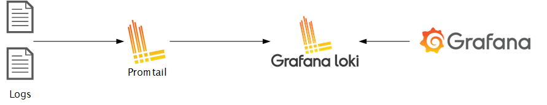

## Loki Sandbox

### Overview

This is a very simple sandbox for experimenting with the log aggregation system "Loki".

  * Loki receives and stores log events, then makes them available via a query API. 

  * Typically, Grafana plugs into this query API as a datasource, thus allowing you to visualise and query your logs.

### Architecture

The diagram below illustrates the components which make up a typical Loki Grafana stack:

* `logs` - this is the source of log message data - it could be a log file, a database, or an AWS Cloudwatch log group.
* `promtail` - collects logs and forwards them to Loki.
* `loki` - parses and stores logs - provides a query API, similar to Prometheus
* `grafana` - used for log visualization

### Forewarning

> :warning: The Loki stack was really intended to be deployed to a **Kubernetes cluster**.

For Java and Javascript applications, you can simply the deployment architecture by: 
 
  * Removing the dependency on Promtail, by using either __Loki4J__, or __Winston Loki__. These libraries will automatically ship logs to Loki, thus simplifying the deployment architecture.

  * Using Amazon managed Grafana.

  * Then, all you need to do is run a Loki instance, and direct your apps to ship to it.

### Contents

  * The [introduction](01-introduction) folder contains an example of a Loki Grafana stack. Logs are scraped from a local log file, which you can append to if you wish to generate new log events.

  * The [Loki4j](02-loki4j) folder contains an example of using the Loki4J Logback appender, which ships logs directly to Loki, and thus removes the need to use Promtail.

